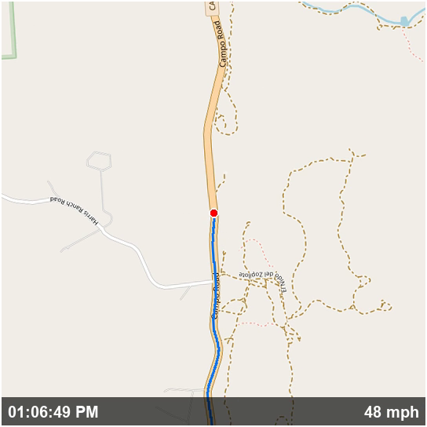

# gopro-map-overlay

Generate a GPS map overlay video from GoPro MP4 files.

Extracts the embedded GPS telemetry (GPMF) from GoPro footage and renders a moving map video showing your route, current position, timestamp, and ground speed. The output is a small standalone video you can layer onto your original footage in any video editor (DaVinci Resolve, Premiere, etc.).



## Features

- Parses GoPro's GPMF telemetry format directly (GPS5 and GPS9)
- Three map styles: **street** (OpenStreetMap), **topo** (OpenTopoMap), **satellite** (ESRI)
- **Heading-up rotation** — map rotates so direction of travel always points up (nav-style)
- **Zoom-in intro** — 5-second animated zoom from state level to street level
- Blue trail showing the route traveled so far
- Red dot for current position
- Semi-transparent info bar with clock time and speed (mph)
- Disk-based tile cache for fast re-runs
- No API keys required

## Requirements

- **Python 3.8+**
- **FFmpeg** (must be on PATH)
- **Pillow** (`pip install Pillow`)

## Installation

```bash
git clone https://github.com/MikeMontana1968/gopro-map-overlay.git
cd gopro-map-overlay
pip install -r requirements.txt
```

## Usage

```bash
# Basic usage (street map, 2 Hz update rate)
python gopro_map_overlay.py GH010157.MP4

# Satellite map
python gopro_map_overlay.py GH010157.MP4 --map satellite

# Topographic map with custom output path
python gopro_map_overlay.py GH010157.MP4 --map topo -o my_overlay.mp4

# All options
python gopro_map_overlay.py GH010157.MP4 \
    --map street \
    --hz 2 \
    --zoom 14 \
    --size 480 \
    -o overlay.mp4
```

### Options

| Flag | Default | Description |
|------|---------|-------------|
| `--map` | `street` | Map style: `street`, `topo`, or `satellite` |
| `--hz` | `2` | Map update rate (frames per second) |
| `--zoom` | `15` | Override cruise zoom level (15 = street-level detail) |
| `--size` | 1/4 video height | Map thumbnail size in pixels |
| `-o` / `--output` | `<input>_map_overlay.mp4` | Output file path |

## Using the overlay in a video editor

The output is a small H.264 video (typically under 1 MB) matching the duration of your source footage. To composite it:

1. Import both the original GoPro MP4 and the overlay MP4
2. Place the overlay on a track above the original video
3. Position it where you want (lower-right corner works well)
4. Optionally adjust opacity, add a drop shadow, or scale it

## How it works

1. **Extract** — Pulls the GPMF binary telemetry stream from the MP4 using FFmpeg
2. **Parse** — Walks the GPMF container hierarchy (DEVC > STRM > GPS5/GPS9), applies SCAL divisors to get decimal lat/lon/alt/speed
3. **Pre-fetch** — Calculates all map tiles needed across the route and zoom levels, downloads them with a disk cache
4. **Render** — For each time step, composites cached tiles, draws trail and position dot, rotates by heading, adds time/speed info bar
5. **Encode** — Assembles the frames into an H.264 video with FFmpeg

## Supported cameras

Any GoPro camera that records GPS telemetry in GPMF format:

- GoPro Hero 5 and later (GPS5 format)
- GoPro Hero 11+ (GPS9 format)

## Map tile attribution

- Street maps: [OpenStreetMap](https://www.openstreetmap.org/copyright) contributors
- Topographic maps: [OpenTopoMap](https://opentopomap.org/about) (CC-BY-SA)
- Satellite imagery: [Esri World Imagery](https://www.arcgis.com/home/item.html?id=10df2279f9684e4a9f6a7f08febac2a9)

## License

MIT
